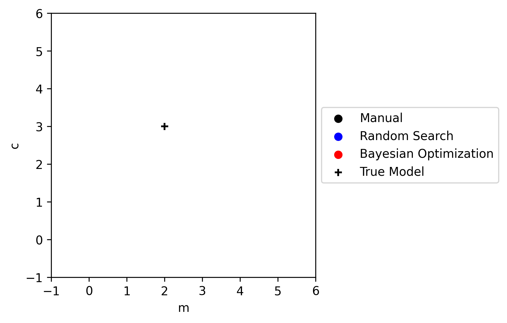
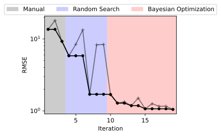

# 💻 digital-experiments

(🏋️, 🐍, 📖) → (💻, 🧪)

A lightweight python library for keeping track of, and optimizing, configuration and results for digital experiments.  

## Walkthrough

The [examples directory](examples/) contains some notebooks that help explain how this package works
- [Basic Overview](examples/digital_experiments.ipynb)
- [Optimising with digital-experiments](examples/optimization.ipynb)

---

    
    

